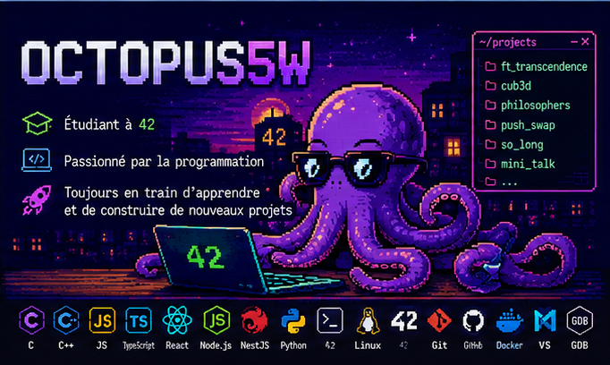

  

---

# 📚 Projets mis en avant

| Projet | Description | Tech |
|---|---|---|
| 🎮 [cub3d](https://github.com/JeSapelHaz/cub3d) | Moteur 3D inspiré de Wolfenstein | C |
| 🍝 [philosophers](https://github.com/Octopus5W/philosophers) | Gestion des threads et synchronisation | C |
| 🔢 [push_swap](https://github.com/Octopus5W/push_swap) | Algorithme de tri optimisé | C |
| 🖼️ [so_long](https://github.com/Octopus5W/so_long) | Petit jeu 2D avec MiniLibX | C |
| 🎨 [minitalk](https://github.com/Octopus5W/minitalk) | Communication entre processus via signaux | C |
| 🌐 [ft_transcendence](https://github.com/JeSapelHaz/ft_transcendence) | Application web multijoueur | TypeScript / React / NestJS |

---

## 📊 Statistiques GitHub

---

## 🔥 Activité GitHub

---

## 🌐 Me contacter

